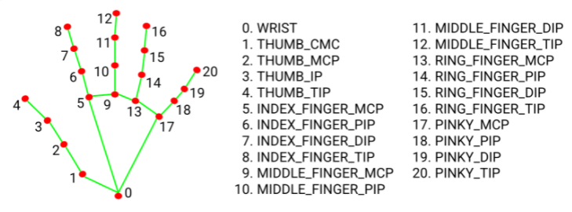
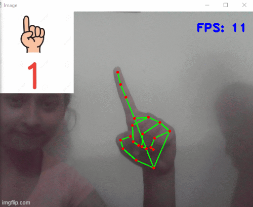

# Facile-Learning

Facile Learning System  
System to make it easy for kids with impaired vision and hearing disabilities to learn - how to communicate using sign language.  
Here is a small part of that vast project with some data on counting numbers using fingers. This system will detect finger signs through the camera. Then process the image to identify the signs and display the meaning on screen as well as, the system will pronounce the meaning.  
If one cannot hear, then one can learn from the screen. If one cannot see, one can learn from system assistance. 

In the future, we can add as many detailed lessons on sign language.  

I have used a hand tracking module and OpenCV to train the system to identify signs. I have used mediapipe to get the hand landmarks to count the fingers. 

## Hand Landmarks

 

And all of this will be happening in real-time and requires close to no installations and configurations.

## Detection :

 

This system can help a lot of kids to learn with ease. Also, it will help their parents to save money as they do not have to pay a massive amount to tutors to teach their disabled kids. They can learn comfortably on their own or, parents can teach them more easily.  
Also, it can help teachers to teach kids in school smoothly and efficiently. 
